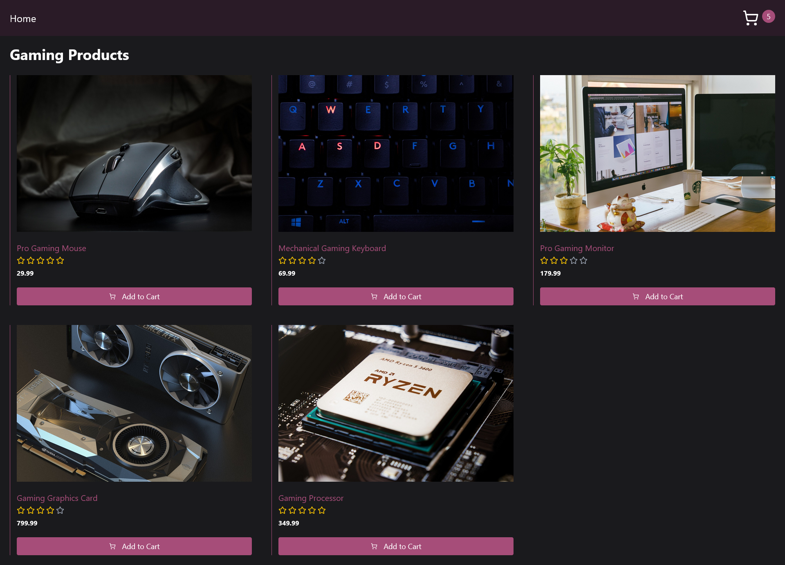
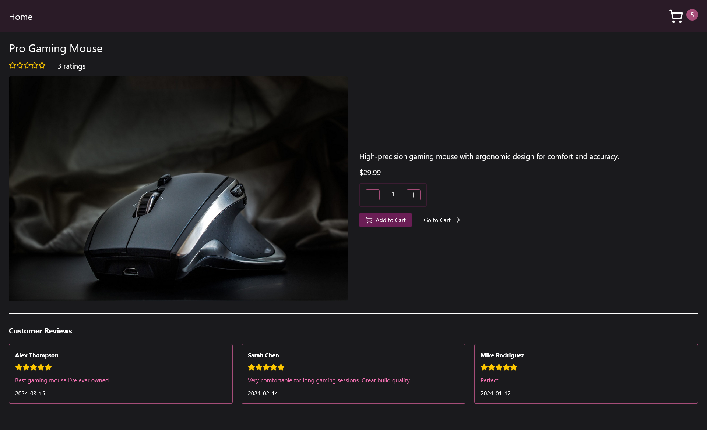
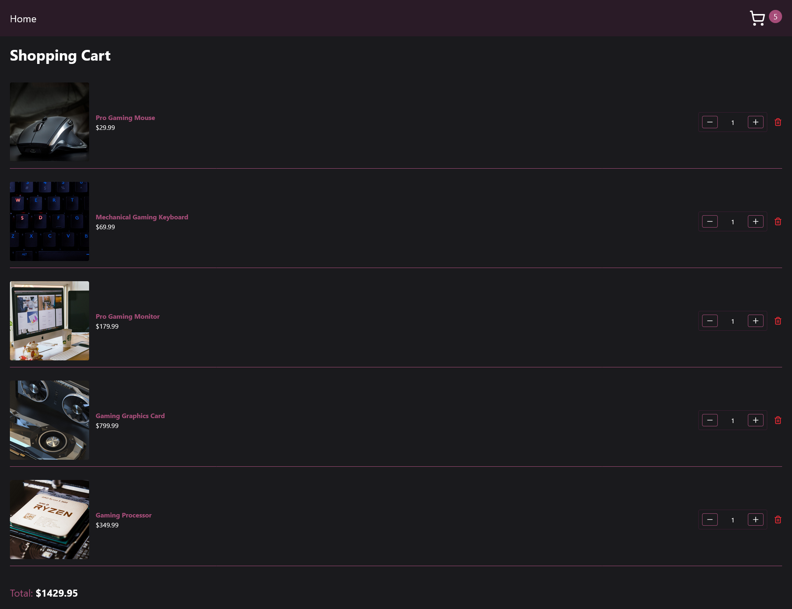

# Simple Multi-page E-commerce App

This project is a simple E-commerce application built using React, React Router, TypeScript and Tailwind CSS. This app is created to help you understand, learn and master The React Context API. This project is suitable for learning core React concepts, such as state management, routing, reusable components and the Context API.

## Home Page

## 

## Product Page

## 

## Cart Page

## 

## Features

- Home Page: Showcasing all the products in the store.
- Product Listing: Browse a list of products with detailed information.
- Reviews: Display all the review individual products have received.
- Shopping Cart: Add products to the cart and update quantities.
- Responsive Design: Optimized for mobile, tablet, and desktop views.

## Taking a Look at the Completed Project

To set up the project after forking or downloading it from GitHub, follow these steps:

1. Open with your favorite code editor

2. Install the required dependencies by running the following command:

```
npm install
```

3. Start the development server by running the following command:

```
npm run dev
```

Happy Coding and Learning 😊
